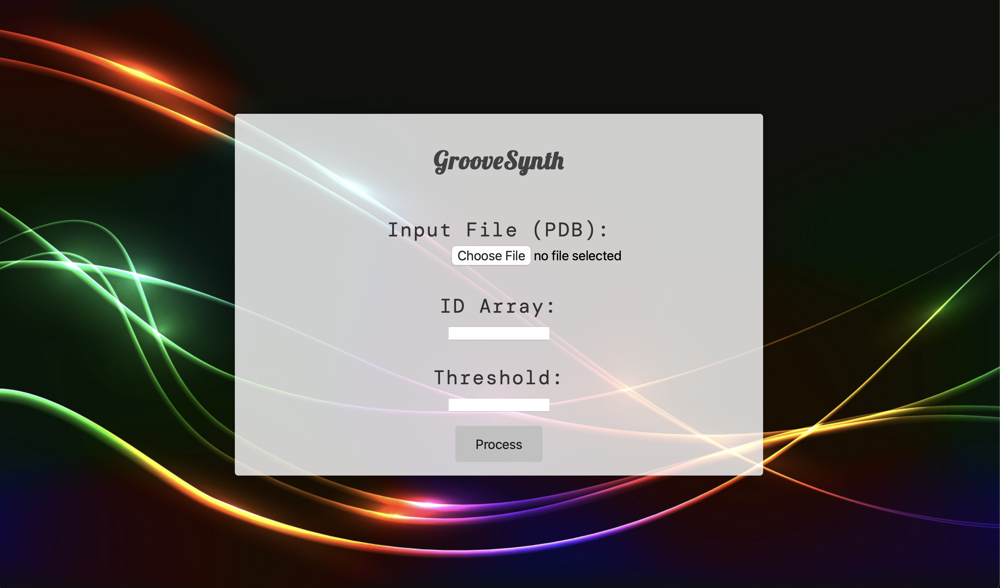

# GrooveSynth


## About the repo

GrooveSynth is a tool that generates structure pdb that mimicks the actual active binding site of the protein.

## How to install 

1. Install from this repo as:

```
git clone https://github.com/Omksaini2003/groove.git
```

2. Create a virtual environment

```
python3 -m venv env 
source env/bin/activate
```

3.  To Run this flask app:

```
python3 app.py
```
   

## How to use



1. Provide the input of the pdb file (eg:- 4dfr.pdb)
2. Enter the serial number (ID) of the active amino acid sites (that are responsible for binding ligand) (eg:- 1,2,5)
3. Enter the threshold distance (Angstrom) (eg:- 1.4)
4. By clicking 'Process', you will be downloading the pdb file connecting all the active site amino acids optimally and mimicking the binding site of the protein.

## Requirements

1. <b> Packages </b> :

* Flask == 3.0.3
* Pip == 22.0.2
* python == 3.10.12

2. <b> OS Systems </b>:  It supports all OS systems (Windows, MACOS, and Linux).
